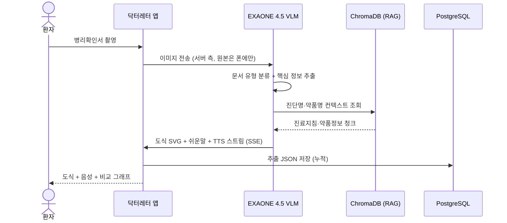

# 🩺 닥터레터 (Doctor Letter) — 개발 시나리오 문서 v5

> **의료정보 격차 해소를 위한 환자 맞춤형 쉬운 의료문서 해석 AI**
> EXAONE 4.5 (33B VLM) 기반 한국어 의료문서 도식화·음성·누적비교·복약 알림 통합 솔루션
>
> **v5 변경사항**:
> - 비식별화 후 EXAONE API 사용 정책 정립 (하이브리드 운용)
> - 알림 채널: 푸시 + SMS 백업 결정
> - 골든셋·의료진 검수 항목 제거 (현 단계 미가용)
> - RAG 검증을 자동화 가능한 항목 중심으로 재구성

---

## 📋 프로젝트 메타

| 항목 | 내용 |
| --- | --- |
| **프로젝트명** | 닥터레터 (Doctor Letter) |
| **팀명 / 대표** | ALIDA / 김경현 (아주대학교) |
| **팀 인원** | 4명 |
| **트랙** | 국내 AI 트랙 |
| **TRL** | 5~6 (시작품 단계) |
| **핵심 모델** | EXAONE 4.5 (33B VLM) — VLM 자체 호스팅 + LLM API |
| **DB 정책** | PostgreSQL 16 (운영) + ChromaDB (RAG) — 2-DB 분리 |
| **EXAONE 운용** | 하이브리드 — VLM은 자체 호스팅, LLM은 비식별화 후 API |
| **알림 채널** | FCM/APNs 푸시 + SMS 백업 (미응답 시) |

---

## 🎯 1. Problem → Solution

### 1.1 Problem
- 의료 리터러시가 낮은 환자(고령자, 저학력·저소득층, 외국인, 중증 신진단 환자)는 의학용어 장벽·문해력 격차·심리적 충격으로 자신의 상태를 이해하지 못한 채 귀가.
- **기존 도구의 한계**
  - **ChatGPT / Google Lens** → 영문/텍스트 위주, 한국 의료 서식에 취약
  - **똑닥 / 굿닥** → 단순 예약·처방전 전달, 문서 이해 기능 부재
  - **국가암정보센터** → 보편적 교육자료, 개별 환자 문서와 미연계

### 1.2 Solution — 4대 핵심 기능

```
┌──────────────────────────────────────────────────────────────┐
│ 가) 의료문서 시각 재구성   병리·진단·검사결과 → 도식 + 음성     │
│ 나) 인포그래픽 변환        근거논문·가이드라인 → 환자용 인포그래픽 │
│ 다) 누적 결과 비교 분석    반복 촬영 → 이전 vs 이번 비교 시각화   │
│ 라) 복약 스케줄 자동화    처방전 촬영 → 자동 스케줄 + 폰 알림     │
└──────────────────────────────────────────────────────────────┘
```

---

## 👥 2. 사용자 페르소나 & 시나리오

### 2.1 핵심 페르소나

| 페르소나 | 특징 | 핵심 니즈 |
| --- | --- | --- |
| **P1. 70대 암 신진단 고령자** | 한자 의학용어 장벽, 큰 글씨/음성 필요 | 병리확인서를 그림·음성으로 이해 |
| **P2. 다약제 복용 만성질환자** | 5종+ 복용, 복약 누락 빈번 | 처방전 촬영 → 자동 알림 |
| **P3. 외국인 환자** | 한국어 의료 서식 이해 어려움 | 다국어 변환 + 시각 설명 |

### 2.2 End-to-End 사용자 여정 (P1 기준)



---

## 🏗️ 3. 시스템 아키텍처

### 3.1 전체 구성 (B2C 단일 채널 + 하이브리드 EXAONE)

```
┌──────────────────────────────────────────────────────────────────┐
│                         Client Layer                              │
│  ┌────────────────────────┐                                       │
│  │ B2C Mobile App         │  + SQLCipher (온디바이스 PHI 저장)    │
│  │ (React Native)         │  + OS 내장 TTS (음성 합성)            │
│  └─────────┬──────────────┘                                       │
└────────────┼──────────────────────────────────────────────────────┘
             │ HTTPS · OAuth 2.1 + Passkey · TLS 1.3
┌────────────┼──────────────────────────────────────────────────────┐
│            ▼                                                      │
│  ┌────────────────────────────────────────────────────────┐      │
│  │              API Gateway (OpenAPI 3.1)                  │      │
│  │   Rate Limit · 감사 로그 · OAuth 2.1 · 푸시 알림 발송     │      │
│  └────────────────────────┬───────────────────────────────┘      │
│                           ▼                                      │
│  ┌─────────────────────────┐    ┌──────────────────────────┐    │
│  │ 🔒 자체 호스팅 (PHI 영역) │    │ 🌐 EXAONE API (비식별 영역)│    │
│  │                          │    │                           │    │
│  │ [1차] EXAONE 4.5 VLM     │    │ EXAONE 4.5 LLM            │    │
│  │ + Guided Decoding ⭐     │ ─→ │ (LG 제공 API)             │    │
│  │ (PHI 필드 미정의 스키마) │ 2차  입력: PHI 없는 의료 텍스트  │    │
│  │                          │ 검증  출력: 환자 친화 자연어     │    │
│  │ [2차] PHI Validator       │ 통과                              │    │
│  │ + 정규식 룰 기반 검증     │      통과 시에만 전송             │    │
│  │ (patient_name, phone…)   │                                   │    │
│  └─────────────────────────┘    └──────────────────────────┘    │
│             │                                  │                  │
│             ▼                                  ▼                  │
│  ┌──────────────────────┐    ┌────────────────────────────┐     │
│  │ Guardrail            │    │  RAG 검색 (ChromaDB)        │     │
│  │ (출력 후처리)         │    │  근거 청크 → API 컨텍스트   │     │
│  │ - 진단·치료·OS 차단   │    │                            │     │
│  └──────────────────────┘    └────────────────────────────┘     │
│                                                                   │
│                    ┌──────────────────┐                          │
│                    │  Guardrail       │                          │
│                    │  (진단·치료·OS    │                          │
│                    │   예측 차단)      │                          │
│                    └──────────────────┘                          │
│                                                                   │
│  ┌──────────────────────────┐  ┌─────────────────────────┐       │
│  │ PostgreSQL 16 (운영)      │  │ ChromaDB (RAG 벡터)      │       │
│  │ - 환자 / 의료문서 메타     │  │ - NCCN/ESMO/약학정보원   │       │
│  │ - 누적 검사결과 (Timescale)│  │ - PubMed 청크            │       │
│  │ - 복약 스케줄              │  │ - bge-m3 임베딩          │       │
│  │ - 의료 용어 사전 (난이도)   │  │ - 메타: source · domain  │       │
│  │ - 잡 큐 (pg-boss)         │  │   · label                │       │
│  │ - 비식별화 토큰 매핑       │  │                         │       │
│  │ - 감사 로그 (pgaudit)      │  │                         │       │
│  └──────────────────────────┘  └─────────────────────────┘       │
└──────────────────────────────────────────────────────────────────┘
```

> 📌 **하이브리드 EXAONE + 2단 정밀 차단 정책**:
> - **VLM (이미지 처리)는 자체 호스팅 + 1차 PHI 차단**: vLLM Guided Decoding으로 PHI 필드를 출력 자체가 불가능하도록 스키마 강제 + 화이트리스트 프롬프트
> - **2차 PHI Validator**: 자체 정규식 룰(patient_name, phone, hospital_name 등)로 VLM 출력 재검증, 패턴 발견 시 즉시 차단
> - **LLM (텍스트 처리)은 EXAONE API**: 2단 차단 모두 통과한 데이터만 API로 전송
> - **이미지 저장 정책**: 원본은 폰의 SQLCipher DB에만 보관 (S3/MinIO 미사용)
> - **알림**: FCM/APNs 푸시 + 사용자 설정 기반 SMS 백업 (폴링 없음)
> - **원칙**: 수집하지 않은 정보는 유출될 수도 없다 (Data Minimization)

### 3.2 6-Stage Pipeline (담당 구간 명시)

| # | 모듈 | 담당 | PHI 영역? | 비고 |
| --- | --- | --- | --- | --- |
| ① | **입력** | 클라이언트 | 🔒 PHI | 카메라 캡처 + 자동 보정 (원본은 폰에만) |
| ② | **[1차] PHI 사전 차단 추출** | 🧠 **EXAONE 4.5 VLM** + Schema-Constrained Output | 🔒 → 🔄 | 처음부터 PHI를 추출하지 않도록 스키마·프롬프트 강제 |
| ②' | **[2차] PHI Validator (자체 룰)** | 우리 백엔드 | 🔄 검증 | 정규식·키워드 룰로 재검사, 패턴 발견 시 차단 |
| ③ | **쉬운말 + 도식 + RAG** | 🧠 **EXAONE 4.5 LLM** (API) | 🌐 비식별 | 검증 통과 데이터로 환자 친화 답변 생성 |
| ④ | **음성 합성** | 🔊 OS 내장 TTS | 🔒 단말 | 클라이언트가 텍스트 → 음성 변환 |
| ⑤ | **누적비교** | 우리 백엔드 | 🔒 PHI | PG TimescaleDB 시계열 분석 (자체 처리) |
| ⑥ | **알림연동** | 우리 백엔드 + FCM/APNs/SMS | 🔒 PHI | 푸시 + 사용자 설정 SMS 동시 발송 (폴링 없음) |

> ⚠️ **2단 정밀 차단 핵심**:
> - **②**: VLM이 Guided Decoding으로 PHI 필드 출력 자체 불가 (스키마·프롬프트 강제)
> - **②'**: 자체 정규식 룰(patient_name, phone, hospital_name 등)로 재검증
> - 두 단계 모두 통과한 데이터만 ③ EXAONE API로 전송

---

## 🧠 4. AI 레이어 (EXAONE 4.5)

### 4.1 모델 구성 — 하이브리드 운용

```yaml
ai_stack:
  base_model: EXAONE 4.5 (33B params, VLM)
  capability: 텍스트 + 이미지 (음성 출력 미지원)
  supported_languages: [ko, en, es, de, ja, vi]

  hybrid_deployment:
    vlm_self_hosted:
      role: 의료문서 이미지 → 구조화 JSON 추출
      reason: 원본 이미지에 PHI(환자명·병원명·얼굴) 포함, 외부 전송 불가
      serving: vLLM (Guided Decoding 지원)
      
    llm_api:
      role: 일반화된 의료 텍스트 → 환자 친화 자연어
      reason: PHI 2단 차단 통과 후엔 외부 API 사용 가능
      provider: LG AI Research EXAONE API
      benefit: GPU 부담 경감, 모델 업그레이드 자동, 양자화·튜닝 불필요
```

#### 두 영역의 분담

| 영역 | 작업 | 데이터 |
| --- | --- | --- |
| **자체 호스팅 VLM** | 이미지 OCR + 구조화 추출 | PHI 포함 가능 (환자 이미지 원본) |
| **EXAONE API (LLM)** | 쉬운말 변환, RAG 답변 생성, 인포그래픽 텍스트 | 2단 PHI 차단 통과 데이터만 |

> 💡 **API 사용으로 인한 단순화**: 양자화·LoRA 파인튜닝·텐서 병렬 등 모델 운영 부담은 LG가 처리합니다. 우리는 VLM 자체 호스팅(PHI 보호용)만 신경 씁니다. 양자화는 우리 일이 아닙니다.

> ⚠️ **이미지 비식별화는 매우 어렵습니다**. 사진에서 얼굴·이름·병원 직인 등을 완벽히 제거하기 어렵기 때문에 **VLM은 자체 호스팅이 사실상 강제**입니다.

### 4.2-1 TTS (음성 출력) 전략

> ⚠️ EXAONE 4.5는 음성을 출력하지 않으므로 별도 TTS 모듈이 필요합니다.

#### TTS 우선순위

```
[1순위] 단말기 OS 내장 TTS  ⭐ 권장
        - iOS:     AVSpeechSynthesizer
        - Android: TextToSpeech API
        - PHI가 폰을 벗어나지 않음 (보안 최강)
        - 비용 0, 네트워크 없어도 작동
        - 한국어 품질 최근 매우 향상됨

[폴백] 네이버 CLOVA Voice
        - 더 자연스러운 고령자 음성 필요 시
        - 단, PHI 비식별화 후 텍스트만 전송
        - 환자 이름·진단명은 일반화한 텍스트만 전송

[제외] 자체 호스팅 TTS (VITS, Coqui XTTS 등)
        - 6개월 안에 한국어 고령자 음성 튜닝 비현실적
        - GPU는 EXAONE 추론에 모두 사용
```

| 옵션 | 한국어 품질 | 데이터 주권 | 비용 | 고령자 친화 |
| --- | --- | --- | --- | --- |
| **OS 내장 TTS** ⭐ | 중상 | ✅ 단말 처리 | 0 | 좋음 (설정으로 속도 조절) |
| **네이버 CLOVA Voice** | 매우 높음 | △ (외부 API) | API 호출당 | 우수 |
| **자체 호스팅 (VITS 등)** | 중 | ✅ | GPU 부담 | 보통 |

#### 응답 흐름 (수정)

```
EXAONE이 쉬운말 텍스트 생성
       ↓
    텍스트만 클라이언트로 전송 (SSE)
       ↓
   클라이언트가 OS TTS로 음성 변환·재생
   (PHI가 서버를 거쳐 외부로 전송되지 않음)
```

### 4.2-2 PHI 2단 정밀 차단 ⭐ 핵심 보안 모듈

> **핵심 원칙: 수집하지 않은 정보는 유출될 수도 없다 (Data Minimization)**
>
> **2단 구조**: 1차 VLM이 거르고, 2차 자체 규칙으로 재검증.

#### 2단 정밀 차단 흐름

```
이미지 입력
    ↓
┌─────────────────────────────────────────────────────┐
│ [1차 차단] VLM Schema-Constrained Output             │
│   - vLLM Guided Decoding으로 JSON 스키마 강제       │
│   - PHI 필드 자체를 스키마에 정의하지 않음          │
│   - 화이트리스트 프롬프트로 보강                    │
│   - 모델이 PHI를 "출력하고 싶어도 출력 불가"       │
└─────────────────────────────────────────────────────┘
                ↓
        PHI 없을 것으로 기대되는 JSON
                ↓
┌─────────────────────────────────────────────────────┐
│ [2차 검증] 자체 규칙 기반 PHI Validator              │
│   - 우리가 정한 정규식·키워드 룰로 재검사           │
│   - JSON 전체를 재귀 순회하며 패턴 매칭             │
│   - PHI 패턴 발견 시 즉시 차단 + 운영자 알림        │
│   - 통과 데이터만 EXAONE API 전송                  │
└─────────────────────────────────────────────────────┘
                ↓
        EXAONE API로 안전하게 전송
```

#### [1차] VLM 사전 차단

```python
# Schema에 PHI 필드 자체를 정의 안 함
ALLOWED_SCHEMA = {
    "type": "object",
    "properties": {
        "doc_type": {"enum": ["pathology", "diagnosis", "lab", "prescription"]},
        "diagnosis_code": {"type": "string"},
        "diagnosis_name_ko": {"type": "string"},
        "stage": {"type": "string"},
        "receptors": {"type": "object", ...},
        "lab_values": {"type": "array", ...},
        "medications": {"type": "array", ...},
        # ⚠️ patient_name, patient_id, hospital, doctor_name, birth_date,
        #    address, phone, email 등 PHI 필드 미정의
    },
    "additionalProperties": False  # 스키마에 없는 필드 자동 거부
}

SYSTEM_PROMPT = """
의료문서 이미지에서 의학 정보만 추출하세요.

# 절대 추출 금지 (이미지에 있어도 무시):
- 환자 이름·환자번호·주민번호
- 의료진 이름·면허번호
- 병원명·주소·전화번호
- 생년월일 (모든 형식)
- 보호자 정보
- 사진·서명·직인
- 거주 지역

# 추출 대상:
- 진단명·검사·처방 등 순수 의학 정보만
"""

response = vllm.generate(
    prompt=SYSTEM_PROMPT + image,
    guided_json=ALLOWED_SCHEMA
)
```

#### [2차] 자체 규칙 기반 PHI Validator

VLM이 100% 완벽하지 않을 수 있으므로 **우리가 정한 명확한 규칙**으로 재검증합니다.

```python
PHI_VALIDATION_RULES = {
    # === 직접 식별자 ===
    "patient_name": [
        r"환자\s*[:：]\s*[가-힣]{2,4}",            # "환자: 김OO"
        r"성명\s*[:：]\s*[가-힣]{2,4}",
        r"이름\s*[:：]\s*[가-힣]{2,4}",
        r"\b[가-힣]{2,4}\s*님",                    # "김OO님"
    ],
    "doctor_name": [
        r"의사\s*[:：]\s*[가-힣]{2,4}",
        r"담당의\s*[:：]\s*[가-힣]{2,4}",
        r"[가-힣]{2,4}\s*(의사|선생|교수|원장)",
        r"Dr\.\s*\w+",
    ],
    "resident_id": [
        r"\d{6}\s*[-‐]\s*\d{7}",                   # 주민번호
        r"\d{6}\s*[-‐]\s*[1-4]",                    # 주민번호 앞부분 + 성별
    ],
    "patient_id": [
        r"환자번호\s*[:：]\s*\S+",
        r"등록번호\s*[:：]\s*\S+",
        r"차트번호\s*[:：]\s*\S+",
        r"\bP-\d{8,}\b",
    ],
    "phone": [
        r"\b01[016-9]\s*[-\s]?\s*\d{3,4}\s*[-\s]?\s*\d{4}\b",
        r"\b\d{2,3}\s*[-\s]?\s*\d{3,4}\s*[-\s]?\s*\d{4}\b",
    ],
    "email": [
        r"[\w._%+-]+@[\w.-]+\.[a-zA-Z]{2,}",
    ],

    # === 위치 정보 ===
    "hospital_name": [
        r"\b[가-힣]+(대학교병원|병원|의원|클리닉)\b(?!\w)",
        r"\b\S+(메디컬센터|보건소)\b",
    ],
    "address": [
        r"(서울|부산|대구|인천|광주|대전|울산|세종|경기|강원|충북|충남|전북|전남|경북|경남|제주)[가-힣\s\d-]+(시|군|구|동|로|길)",
        r"\b\d{5}\b\s*우편번호",
    ],

    # === 시간 정보 ===
    "birth_date": [
        r"생년월일\s*[:：]\s*[\d./-]+",
        r"생일\s*[:：]\s*[\d./-]+",
        r"\b(19|20)\d{2}[./년-]\s*\d{1,2}[./월-]\s*\d{1,2}\s*[일]?",
    ],

    # === 보호자 ===
    "guardian": [
        r"보호자\s*[:：]\s*[가-힣]{2,4}",
        r"가족\s*연락처",
    ],
}

class PHIValidator:
    def __init__(self):
        self.rules = {
            category: [re.compile(p) for p in patterns]
            for category, patterns in PHI_VALIDATION_RULES.items()
        }
    
    def validate(self, data: dict) -> ValidationResult:
        """JSON 전체를 재귀적으로 순회하며 PHI 패턴 검사"""
        violations = []
        
        def scan(value, path=""):
            if isinstance(value, str):
                for category, patterns in self.rules.items():
                    for pattern in patterns:
                        if match := pattern.search(value):
                            violations.append({
                                "path": path,
                                "category": category,
                                "matched": match.group(),
                                "value_preview": value[:50]
                            })
            elif isinstance(value, dict):
                for k, v in value.items():
                    scan(v, f"{path}.{k}")
            elif isinstance(value, list):
                for i, v in enumerate(value):
                    scan(v, f"{path}[{i}]")
        
        scan(data)
        return ValidationResult(passed=len(violations) == 0, violations=violations)
```

#### 검증 규칙 카테고리

| 카테고리 | 검사 대상 |
| --- | --- |
| `patient_name` | "환자: 김OO", "OO님" 패턴 |
| `doctor_name` | 의사·교수·원장 + 한글 이름 |
| `resident_id` | 주민번호 (6-7자리) |
| `patient_id` | 환자번호·등록번호·차트번호 |
| `phone` | 휴대폰·일반전화 패턴 |
| `email` | 이메일 형식 |
| `hospital_name` | "OO병원", "OO의원" 등 의료기관명 |
| `address` | 시·도·구·동 주소 패턴 |
| `birth_date` | 생년월일 (다양한 형식) |
| `guardian` | 보호자 정보 |

#### 통합 호출 흐름

```python
async def call_exaone_api(image: bytes) -> str:
    # [1차] VLM Schema-Constrained Extraction
    extracted = await vllm.extract(
        image=image,
        prompt=SYSTEM_PROMPT,
        guided_json=ALLOWED_SCHEMA,
    )
    
    # [2차] 자체 규칙 기반 PHI Validator
    validator = PHIValidator()
    result = validator.validate(extracted)
    
    if not result.passed:
        log_security_event(
            "PHI_DETECTED_AFTER_VLM",
            violations=result.violations
        )
        raise PHIDetectedError("VLM 출력에 PHI 패턴 감지 — API 전송 차단")
    
    # 통과 시에만 EXAONE API 전송
    response = await exaone_api.complete(
        prompt=build_prompt(extracted),
        audit_token=generate_audit_token(),
    )
    
    return response
```

#### False Positive 관리 (의학 정보까지 차단되지 않도록)

```python
# ⚠️ 너무 공격적인 룰은 의학 정보까지 매칭됨
# 예: r"\S*(병원|의원)" → "당뇨병원인은..." 매칭

# ✅ 단어 경계 + 부정 lookahead로 정밀화
"hospital_name": r"\b[가-힣]+(대학교병원|병원|의원|클리닉)\b(?!\w)"
```

**False Positive 관리 방법**:
1. **양성·음성 케이스 데이터셋 100개 이상 구축** → 정규식 튜닝
2. **차단 사유(matched pattern)를 함께 로깅** → 정기 검토로 룰 개선
3. **음성 케이스 단위 테스트** — 의학 정보가 통과하는지 검증

```python
def test_validator_no_false_positive():
    v = PHIValidator()
    # 의학 정보는 통과해야 함
    assert v.validate({"diagnosis": "유방암"}).passed
    assert v.validate({"drug_name": "메트포르민"}).passed
    assert v.validate({"value": "100mg"}).passed
    
    # PHI는 차단되어야 함
    assert not v.validate({"memo": "환자: 김경현"}).passed
    assert not v.validate({"memo": "010-1234-5678"}).passed
```

#### 한계와 대응

| 케이스 | 처리 |
| --- | --- |
| 이미지 자체의 시각적 PHI (얼굴 등) | VLM 자체 호스팅으로 외부 미전송 |
| 1차에서 못 거른 PHI (Guided Decoding 우회 등) | 2차 Validator가 안전망 |
| 정규식이 못 잡는 신종 패턴 | 운영 중 발견 시 룰에 추가 |
| False Positive (의학 정보 차단) | 양성·음성 케이스 테스트로 정밀화 |

### 4.3 RAG 데이터 파이프라인 (별도 ETL)

> ⚠️ **중요**: 근거 검색은 EXAONE이 자동으로 하지 않습니다. **사전 ETL 파이프라인**으로 정제·임베딩한 뒤 ChromaDB에 저장해야 합니다.

```
┌──────────┐   ┌─────────┐   ┌─────────┐   ┌──────────┐   ┌──────────┐
│ Scraper  │─▶│ Cleaner │─▶│ Chunker │─▶│ Embedder │─▶│ ChromaDB │
│ (주기 배치)│   │ (PDF/HTML)│  │ (의미 단위)│ │ (bge-m3) │   │           │
└──────────┘   └─────────┘   └─────────┘   └──────────┘   └──────────┘
                                                                  │
                                                                  ▼
                                                       ┌─────────────────┐
                                                       │ (질의 시)        │
                                                       │ Retrieval       │
                                                       │ → EXAONE 컨텍스트│
                                                       │ → 쉬운말 변환    │
                                                       └─────────────────┘
```

| 단계 | 도구 | 역할 |
| --- | --- | --- |
| **Scraper** | scrapy / requests | 화이트리스트 출처 주기 수집 (주 1회) |
| **Cleaner** | pdfplumber, BeautifulSoup | 노이즈 제거, 표·각주 정리 |
| **Chunker** | langchain text splitter | 500~1000 토큰 의미 단위 분할 |
| **Embedder** | bge-m3 (다국어, 1024차원) | 벡터화 |
| **저장** | ChromaDB | HNSW 인덱스, source/version/domain 메타 |
| **Retrieval** | 유사도 검색 + 메타 필터 + 재순위화 | 환자 컨텍스트 기반 top-k |
| **쉬운말 변환** | 🧠 EXAONE 4.5 LLM | 검색 청크를 환자 수준 자연어로 풀이 |

스크래핑은 **사전 작업**입니다. 사용자 질의 시 실시간 크롤링하지 않습니다 (속도·법적 리스크).

---

### 4.4 RAG 검증 파이프라인 (5-Gate Validation)

> 의료 도메인은 잘못된 청크 하나가 환자 안전을 위협합니다. **각 게이트를 통과 못하면 격리(quarantine)** 합니다.

```
[Gate 1 출처]  →  [Gate 2 구조]  →  [Gate 3 내용]  →  [Gate 4 의료]  →  [Gate 5 임베딩]
   ↓                  ↓                  ↓                  ↓                  ↓
화이트리스트       파싱 품질         의미 완결성        의학 정합성        벡터 정상성
```

#### Gate 1 — 출처 신뢰성
- 화이트리스트 도메인만 수집 (HTTPS 인증서 검증, 라이선스 호환성)
- 컨텐츠 해시로 중복 갱신 방지
- 버전·발행일 메타 추출 가능 여부

#### Gate 2 — 구조 검증

| 검증 항목 | 임계값 |
| --- | --- |
| 최소 길이 | ≥ 100자 |
| 최대 길이 | ≤ 50,000자 |
| 한글 비율 (ko 자료) | ≥ 30% |
| 깨진 문자 비율 | ≤ 5% |
| 중복 줄 비율 | ≤ 20% |
| HTML/스크립트 잔재 | 0건 |

#### Gate 3 — 내용 검증
- 청크가 문장 중간에서 잘리지 않았는가
- 토큰 수: 50~512 (임베딩 모델 한계 내)
- 의미 밀도: 표·숫자만으로 구성된 청크 배제
- 약품명·용량은 한 청크에 묶기

#### Gate 4 — 의료 도메인 검증 ⭐ 가장 중요

```python
# 4-1. 의학 용어 정합성 (KOSTOM, UMLS 한국어 사전)
# 4-2. 단위·수치 검증
DANGEROUS_UNIT_AMBIGUITIES = [
    ("혈당", ["mg/dL", "mmol/L"]),       # 5배 차이
    ("크레아티닌", ["mg/dL", "μmol/L"]),
    ("HbA1c", ["%", "mmol/mol"]),
]

# 4-3. 차단 패턴 (정규식)
BLOCKED_PATTERNS = [
    r"당신은\s+\w+\s*입니다",   # 직접 진단
    r"이\s*약을?\s*(끊으|중단)", # 직접 처방 변경
    r"민간요법|기적의|완치",     # 비검증 대체요법
    r"클릭|구매|할인",           # 광고성
]

# 4-4. 가이드라인 버전 검증 (5년 이상 묵은 자료 격리)
# 4-5. LLM 보조 분류 (EXAONE에 청크 의도 분류 요청)
```

#### Gate 5 — 임베딩 검증
- 차원 일치 (bge-m3 = 1024)
- NaN/Inf 검사
- 영벡터 검사
- 중복 청크 검사 (코사인 유사도 > 0.99)

### 4.5 도메인 적합성 검증 (5층 방어)

> "원했던 정보는 약품인데 경제 논문이 섞이면?" 같은 도메인 오염을 막는 다층 방어.

```
[L1 출처 차단] → [L2 메타 필터] → [L3 임베딩 거리] → [L4 분류기] → [L5 LLM 판정]
   100%             90%               70%              95%             99%
```

| 위협 시나리오 | 막는 층 |
| --- | --- |
| 경제 논문 사이트 통째 수집 | **L1 출처 화이트리스트** |
| 의료 사이트 안의 비의료 컨텐츠 | **L2 MeSH/메타 필터** |
| 의료지만 다른 하위 도메인 | **L3 임베딩 거리 (centroid)** |
| 약학정보원의 광고/마케팅 배너 | **L4 zero-shot 분류기** |
| 가이드라인 부록·인용 텍스트 | **L5 LLM 판정** |
| 사후 발견된 오염 청크 | **사용자 피드백 모니터링** |

#### L2 — PubMed MeSH 필터링 예시
```python
TARGET_MESH = {"D004364": "Drug Therapy", ...}
EXCLUDED_MESH = {
    "D003363": "Cost-Benefit Analysis",  # 경제 분석 제외
    "D026261": "Veterinary Drugs",        # 수의학 제외
    "D008519": "Marketing",
}
```

#### L3 — Centroid Distance (신뢰 출처 기반)
```
1. 신뢰 출처 reference set (자동 수집) → 임베딩 평균 → domain_centroid
2. 새 청크 임베딩과의 cosine distance < 0.45 만 통과
3. 도메인별 centroid 다중 운영 (drug_info, oncology, guideline, patient_edu)
```

> 📌 **Reference set은 자동 구축**: 의료진 검수 없이 **공개·검증된 출처에서 자동 수집**합니다.

##### Reference set 자동 구축 절차
```
[Step 1] 신뢰 출처 화이트리스트로부터 자동 수집 (300~500개)
  - 국가암정보센터 환자 교육자료 (정부 발행, 한국어 ✓)
  - 약학정보원 일반인용 DB (정부 인증)
  - PubMed Central Open Access (peer-reviewed, MeSH 태그 ✓)
  - WHO 환자 교육 문서 (국제 표준)
  → 이미 권위 있는 출처가 검증한 자료이므로 그 자체가 reference

[Step 2] Poisoning set 자동 구축 (200개)
  - 의도적 오염 샘플
  - 경제 논문, 마케팅, 수의학, 일반 뉴스, 일상 블로그
  - 임계값 ROC 분석용

[Step 3] 자동 검증 — 운영 데이터로 점진 개선
  - 사용자 "도움 안 됨" 피드백 → reference에서 제외 후보
  - 사용자 "도움됨" 피드백 + L1~L4 통과 → 신규 reference 후보
  - 자동 클러스터링으로 분포 이상 청크 발견
```

> 💡 **핵심 발상 전환**: 의료진이 검수한 골든 셋이 없어도, **이미 권위 있는 기관(정부·국제기구·peer-review)이 검증해 발행한 자료**를 reference로 삼으면 충분히 baseline을 만들 수 있습니다.

#### L4 — Zero-shot 분류기 (mDeBERTa-v3 NLI)
- "약품 정보 / 경제 분석 / 법률 / 마케팅 / 수의학 / 일반 뉴스" 중 분류
- "약품 정보" 1등 + 신뢰도 ≥ 0.6 만 통과

#### L5 — borderline 청크만 LLM 검증
- L3 거리가 0.35~0.45 범위인 애매한 청크에만 적용 (비용 절감)

---

### 4.6 화이트리스트 자동화 (반자동 운영)

> 1000개 도메인 직접 입력 대신, **자동 발굴 + 사람 승인** 구조.

#### 자동 수집 파이프라인
```
[학술 메타 인프라]   →   DOAJ / CrossRef / PubMed Central
       ↓                   → 의료 학술지 도메인 자동 등록 후보
[권위 시드 전파]     →   NCCN/ESMO/WHO/FDA/약학정보원 5~10개
       ↓                   → 외향 링크 follow → 트러스트 전파
[도메인 자동 점수화] →   TLD(.gov/.edu) + DOAJ 등재 + 인증서 + 운영기간 + DNSSEC
       ↓                   → score ≥ 0.7 → 자동 등록
                            → score 0.5~0.7 → 팀 운영자 검토 큐
[적응형 발굴]        →   RAG 답변 실패 질의 분석 → 후보 도메인 발굴
       ↓
[운영자 검토 큐]     →   주간 추천 리스트 → 팀에서 승인/거부
       ↓
[화이트리스트 갱신]  →   자동 재인덱싱
```

> 작업 형태 변화: **"전수 입력"** → **"검토 승인"**
> 수십 시간 작업 → 30분 작업

> ⚠️ **검토 주체**: 의료진 자문이 가능해지기 전까지는 팀 내부에서 권위 시드 기준에 부합하는지 확인. 의료진 자문이 확보되면 그때 검수 단계 추가.

### 4.7 라벨 발굴 시스템 (미등록 라벨 처리)

> 사용자가 묻는 주제가 라벨 체계에 없을 때 어떻게 답하나?

#### 전략 1 — 계층 라벨 + Fallback
```python
LABEL_TAXONOMY = {
    "medical": {
        "drug": {
            "info": ["dosage", "interaction", "side_effect"],
            "_fallback": "drug_other",
        },
        "disease": {...},
        "_fallback": "medical_other",
    },
    "_fallback": "uncategorized",
}
```
미등록 청크는 `medical_other` 임시 통에 들어감 — 영역은 식별되지만 격리 상태.

#### 전략 2 — 동적 클러스터링 (분기별)
```
1. medical_other 통의 청크가 50개 이상 누적
2. HDBSCAN 밀도 클러스터링 (임베딩 기반)
3. 각 클러스터 5개 샘플을 EXAONE에 보내 라벨 제안
4. 팀 운영자 검토 큐 → 승인 시 새 라벨 등록
   (의료진 자문 확보 후엔 의료 검수 단계 추가)
```

#### 전략 3 — Open-vocabulary 분류
- EXAONE이 즉석에서 라벨 명명 → `proposed:` 접두사로 임시 저장
- 보수적 검색은 승인된 라벨만, 탐색적 검색은 임시 라벨 포함

#### 전략 4 — 검색 시점 Graceful Fallback
```
1단계: 정확 라벨 매칭 검색
  ↓ 결과 < 3개
2단계: 상위 라벨로 확장 (drug_interaction → drug)
  ↓ 결과 < 3개
3단계: 라벨 무시, 의미 유사도만
  ↓ 결과 < 3개
4단계: 답변 거부 + "의료진과 상의하세요" + 라벨 보강 시그널 로깅
```

#### 전략 5 — Negative Knowledge Base ⭐ 의료 핵심
- 라벨 미매칭 또는 자료 < 2개 → **답변 생성 거부**
- 답변과 청크의 grounding score < 0.7 → 거부
- 환각 방지의 마지막 안전망

### 4.8 Guardrail 정책

> 🚫 **EXAONE 출력 중 다음은 절대 생성하지 않습니다.**

| 차단 대상 | 예시 | 차단 이유 |
| --- | --- | --- |
| **진단 발화** | "당신은 ○○ 암입니다" | 의료법 위반, SaMD 해당 |
| **치료 권고** | "이 약을 끊으세요" | 처방 변경 유도 위험 |
| **예후 예측** | "5년 생존율 ○%", **OS 추정** | 환자 심리·임상 판단 침해 |
| **응급 자가판단** | "병원 안 가도 됩니다" | 환자 안전 위험 |

**대신 출력하는 것**: 의료진이 실제로 작성·기록한 내용을 **있는 그대로** 풀어 설명.

```
✅ "병리확인서에 ER 양성, PR 양성, HER2 음성으로 기록되어 있습니다.
    호르몬에 반응하는 종류라는 표시입니다."

❌ "이 결과로 보면 예후가 좋습니다."   ← 차단
❌ "5년 후 ○% 확률로..."              ← 차단 (OS 예측)
❌ "이 약을 끊어도 됩니다."             ← 차단
```

가드레일 구현:
- **시스템 프롬프트 레벨**: 진단·치료·예후 발화 금지
- **출력 후처리 레벨**: 정규식 + 분류기로 위반 표현 검출 → 재생성
- **항상 footer**: "다음 진료 시 의료진과 상의하세요"

### 4.9 도식 템플릿 — 3-Layer 통합 구조

> 💡 **레고 조립식 구조**: 17개 컴포넌트로 환자 케이스 무한대 표현 가능

#### 3-Layer 설계

```
[Layer 1] 문서 카테고리 (4개)
   pathology / diagnosis / lab_result / prescription
        ↓
[Layer 2] 부위 마커 (8~10개, 재사용 가능)
   lung / breast / liver / stomach / colon / brain / bone / lymph_node / thyroid / kidney
        ↓
[Layer 3] 병변 종류 (3개, 재사용 가능)
   primary (원발) / metastasis (전이) / recurrence (재발)
        ↓
   3 레이어가 조립되어 환자별 통합 도식 생성
```

#### 왜 이 구조인가 — 전이 케이스 대응

> ⚠️ **단순 문서별 단일 출력의 위험**: 폐암 + 뇌 전이 환자에게 "폐 도식"만 보여주면 뇌 전이 정보가 누락되어 환자가 자신의 상황을 잘못 이해할 수 있음. 잠재적 의료 안전 문제.

전이는 흔합니다 — 폐암 진단 시 ~40%, 위암 ~30~40%, 대장암 진단 시 ~20%. 닥터레터의 핵심 페르소나가 중증 신진단 환자라 전이 케이스가 빈번합니다.

#### 통합 신체 지도 렌더링

```
환자 데이터:
  lesions: [
    {site: "lung", type: "primary", size: "2.3cm", biomarkers: {EGFR: "+"}},
    {site: "brain", type: "metastasis", size: "0.8cm", primary_origin: "lung"}
  ]
              ↓
┌────────────────────────────┐
│  🧍 인체 실루엣              │
│   ● 뇌 (전이, 0.8cm)         │
│      ↑ 화살표                │
│   ● 폐 (원발, 2.3cm, EGFR+) │
└────────────────────────────┘
              ↓
   부위별 상세 카드:
   - 원발: 폐 (2.3cm, EGFR 양성)
   - 전이: 뇌 (0.8cm)
              ↓
   음성: "이 결과지에는 두 부위 정보가 있습니다.
         처음 시작된 곳은 폐로, 종양 크기 2.3cm입니다.
         폐에서 뇌로 전이된 부위가 있고 0.8cm 크기입니다.
         자세한 치료 계획은 의료진과 상의하세요."
```

#### 데이터 스키마 — lesions 배열 구조

```python
{
  "doc_type": "pathology",
  "lesions": [                                    # ⭐ 배열로 다부위 지원
    {
      "site": "lung",                             # Layer 2 부위 마커 ID
      "site_ko": "폐",
      "lesion_type": "primary",                   # Layer 3 병변 종류
      "size": "2.3cm",
      "biomarkers": {"EGFR": "mutation+"},
    },
    {
      "site": "brain",
      "site_ko": "뇌",
      "lesion_type": "metastasis",
      "size": "0.8cm",
      "primary_origin": "lung"                    # 어디서 왔는지
    }
  ],
  "stage_overall": "cT2N1M1",
  "metastasis_present": True
}
```

#### Layer 2 — 부위 마커 컴포넌트 명세

| 부위 ID | 한국어 | 인체 좌표 (x, y) | 부위별 슬롯 |
| --- | --- | --- | --- |
| `lung` | 폐 | (좌·우 폐 좌표) | EGFR, ALK, PD-L1 |
| `breast` | 유방 | 가슴 좌표 | ER, PR, HER2 |
| `liver` | 간 | 우상복부 | AFP |
| `stomach` | 위 | 좌상복부 | Borrmann |
| `colon` | 대장 | 복부 | KRAS, BRAF |
| `brain` | 뇌 | 머리 | (단순 위치) |
| `bone` | 뼈 | 척추·골반 | (단순 위치) |
| `lymph_node` | 림프절 | 다발성 | (위치 N개) |
| `thyroid` | 갑상선 | 목 | TSH 연계 |
| `kidney` | 신장 | 후복강 | (단순 위치) |

#### Layer 3 — 병변 종류 스타일

| 종류 | 시각 표현 | 음성 안내 시 |
| --- | --- | --- |
| `primary` | 큰 원, 빨간색 채움 | "처음 시작된 곳" |
| `metastasis` | 작은 원 + 화살표 (from primary) | "전이된 부위" |
| `recurrence` | 점선 원 | "재발된 부위" |

#### 조합 케이스 예시

| 환자 케이스 | 자동 조립 결과 |
| --- | --- |
| 유방암 단일 | 병리 템플릿 + breast(primary) |
| 폐암 + 뇌 전이 | 병리 템플릿 + lung(primary) + brain(metastasis) + 화살표 |
| 대장암 + 간 전이 + 폐 전이 | 병리 템플릿 + colon(primary) + liver(meta) + lung(meta) + 화살표 2개 |
| 단순 검사결과 | 검사 템플릿 + 정상 범위 게이지 (부위 마커 무관) |

#### EXAONE VLM 출력 → 도식 매핑

```
┌─ EXAONE VLM 출력 (JSON) ──────────┐    ┌─ 우리 도식 라이브러리 ─┐
│ {                                  │    │                       │
│   doc_type: "pathology",           │ 매핑 │ Layer 1: pathology   │
│   lesions: [                       │ ───▶ │ Layer 2: lung+brain │
│     {site:"lung", type:"primary"...}    │ Layer 3: primary+    │
│     {site:"brain", type:"meta"...}      │          metastasis  │
│   ]                                │    │                       │
│ }                                  │    │ → 통합 신체 지도 SVG  │
└────────────────────────────────────┘    └───────────────────────┘
```

#### 다부위 통합 음성 안내 생성

```python
def generate_voice_narration(lesions: list) -> str:
    if len(lesions) == 1:
        l = lesions[0]
        return f"{l.site_ko}의 한 부위에 {l.size} 크기의 종양이 있습니다."
    
    # 다부위 — 원발과 전이 분리해서 안내
    primary = next((l for l in lesions if l.lesion_type == "primary"), None)
    mets = [l for l in lesions if l.lesion_type == "metastasis"]
    
    parts = []
    if primary:
        parts.append(f"처음 시작된 곳은 {primary.site_ko}로, "
                    f"종양 크기는 {primary.size}입니다.")
    
    if mets:
        sites = ", ".join(m.site_ko for m in mets)
        parts.append(f"{primary.site_ko}에서 {sites}(으)로 전이된 부위가 있습니다.")
    
    parts.append("자세한 치료 계획은 의료진과 상의하세요.")
    return " ".join(parts)
```

> ⚠️ **의료 안전 가드레일**: 통합 도식은 **문서에 기록된 사실의 시각적 재구성**까지가 한계. 다음은 절대 금지:
> - ❌ "전이가 적으니 좋은 상태입니다" (예후 판단)
> - ❌ "이 치료법이 좋습니다" (치료 권고)
> - ❌ "생존율 ○%" (OS 예측)
> - ✅ "여러 부위를 함께 치료하는 계획이 필요합니다" (사실 기술)
> - ✅ "자세한 계획은 의료진과 상의하세요" (안전 안내)

#### 만들어야 할 컴포넌트 (총 17개)

```yaml
layer_1_document_templates:  # 4개
  - pathology
  - diagnosis
  - lab_result
  - prescription

layer_2_site_markers:        # 10개 (재사용)
  - lung, breast, liver, stomach, colon
  - brain, bone, lymph_node, thyroid, kidney

layer_3_lesion_styles:       # 3개 (재사용)
  - primary, metastasis, recurrence

# 합계: 17개 컴포넌트 → 무한대 환자 케이스 조합 가능
```

도식 템플릿 라이브러리는 **공개된 의료 가이드라인 표준 도식(NCCN, 국가암정보센터 등)을 참고**하여 구축하며, EXAONE 출력 키와 슬롯 이름은 매핑 사전으로 관리합니다.

---

## 📱 5. B2C 모바일 앱 (React Native)

### 5.1 접근성 요구사항

```yaml
accessibility:
  font:
    dynamic_size: true
    min_size: 18sp
    max_size: 32sp
  contrast: WCAG 2.1 AA
  touch_target: ≥ 48dp
  screen_reader: VoiceOver / TalkBack
  voice_io:
    tts: 한국어 고령자 친화 (느린 속도)
    stt: "이게 뭐예요?" 음성 질문 지원
  i18n:
    languages: [ko, en, zh, vi]
```

### 5.2 주요 화면 플로우

```
[홈] ──┬── [문서 촬영] ── [AI 분석 중] ── [도식+음성 결과]
       │                                       │
       │                                       └── [누적 비교 그래프]
       │
       ├── [복약 알림] ── [처방전 촬영] ── [자동 스케줄] ── [알림 설정]
       │
       └── [근거 자료] ── [질문 입력] ── [인포그래픽 변환]
```

### 5.3 핵심 컴포넌트 (React Native UI)

> 💡 EXAONE 필드값과 무관, EXAONE 출력을 받아 화면에 그리는 역할만.

| 컴포넌트 | 역할 |
| --- | --- |
| `<DocumentCamera>` | 의료문서 촬영, 자동 보정 |
| `<EasyTextRenderer>` | 큰 글씨 + TTS 동기화 |
| `<TrendChart>` | 검사 수치 누적 비교 (Victory Native) |
| `<MedScheduleTimeline>` | 복약 시간표 + 알림 토글 |
| `<TermPopover>` | "이게 뭐예요?" 의료 용어 풀이 팝오버 |

---

## 🔌 6. RESTful API (B2C용)

### 6.1 인증 — OAuth 2.1 + PKCE

> **OAuth 2.1**은 OAuth 2.0의 보안 강화 통합 표준입니다.
> - PKCE(Proof Key for Code Exchange) **필수**
> - Implicit Flow, Resource Owner Password Credentials Flow **폐기**
> - Refresh Token Rotation 권장
> - 리다이렉트 URI 정확 매칭 의무화

```yaml
auth:
  protocol: OAuth 2.1 + PKCE (Authorization Code Flow)
  identity_options:
    - 이메일 + 비밀번호 (Argon2id 해싱)
    - Passkey (WebAuthn) — 고령자 친화 옵션
  access_token: JWT (15분)
  refresh_token: rotation, 7일
  transport: TLS 1.3 (HTTPS 강제)
```

### 6.2 주요 엔드포인트 (REST 규칙)

| Method | Path | 설명 |
| --- | --- | --- |
| `POST` | `/v1/documents` | 의료문서 업로드 → 분석 시작 (SSE 응답) |
| `GET` | `/v1/documents/{documentId}` | 분석 결과 조회 |
| `POST` | `/v1/prescriptions` | 처방전 업로드 → 스케줄 생성 |
| `GET` | `/v1/patients/{patientId}/lab-trends` | 누적 검사결과 추이 |
| `GET` | `/v1/patients/{patientId}/lab-trends/{testCode}` | 특정 검사 항목 추이 |
| `POST` | `/v1/evidence/infographics` | 근거 자료 인포그래픽 생성 |
| `POST` | `/v1/terms/{term}/explain` | 의료 용어 재풀이 |
| `GET` | `/v1/medications/schedules` | 복약 스케줄 목록 |
| `PATCH` | `/v1/medications/schedules/{scheduleId}` | 알림 토글 등 부분 수정 |

### 6.3 응답 — Server-Sent Events 스트림

```http
POST /v1/documents
Content-Type: multipart/form-data
Accept: text/event-stream
```

```
event: meta
data: {"documentId": "doc_01HXYZ...", "docType": "pathology_report", "confidence": 0.93}

event: extracted
data: {"tumorType": "Invasive ductal carcinoma", "stage": "T2N0M0",
       "receptors": {"ER": "+", "PR": "+", "HER2": "-"}}

event: diagram
data: {"format": "svg", "content": "<svg viewBox='...'>...</svg>"}

event: explanation
data: {"textKo": "병리확인서에 ER 양성으로 기록되어 있습니다.",
       "termsToExplain": ["에스트로겐 수용체", "HER2"],
       "ttsHints": {"speed": 0.85, "voice": "ko-KR-Neural2-A"}}

event: evidence
data: {"refs": [{"source": "NCCN", "version": "2026.v1"}]}

event: done
data: {"guardrailFlags": []}
```

> 💡 **음성 처리는 클라이언트 측**: 서버는 텍스트만 보내고, 클라이언트(React Native)가 OS 내장 TTS로 음성 변환·재생합니다. `ttsHints`로 속도(고령자 모드)와 보이스를 권고합니다.

이 방식의 이점:
- **서버에 오디오 파일 미저장** (PHI 추가 노출 면적 제거)
- 사용자 단말에서만 음성 합성 → PHI가 서버 외부로 나가지 않음
- 사용자 OS 설정(글꼴 크기, TalkBack 등)과 자연 통합
- 네트워크 일부 끊겨도 음성 재생은 계속됨

---

## 💾 7. 데이터 모델

### 7.1 PostgreSQL (운영)

```sql
-- 확장
CREATE EXTENSION timescaledb;
CREATE EXTENSION pgcrypto;
CREATE EXTENSION pgaudit;

-- 환자
CREATE TABLE patients (
  id           UUID PRIMARY KEY DEFAULT gen_random_uuid(),
  display_name TEXT,
  birth_year   INT,
  language     TEXT DEFAULT 'ko',
  created_at   TIMESTAMPTZ DEFAULT now()
);

-- 의료문서 (이미지 원본 미저장 — 추출 결과만)
CREATE TABLE medical_documents (
  id              UUID PRIMARY KEY,
  patient_id      UUID REFERENCES patients(id),
  doc_type        TEXT,           -- pathology / diagnosis / lab / prescription
  extracted_json  JSONB,          -- EXAONE VLM 출력
  diagram_svg     TEXT,           -- 생성된 도식 (선택 저장)
  taken_at        DATE,
  created_at      TIMESTAMPTZ DEFAULT now()
);

-- 누적 검사결과 (TimescaleDB hypertable)
CREATE TABLE lab_results (
  patient_id     UUID NOT NULL,
  document_id    UUID,
  test_code      TEXT NOT NULL,
  test_name_ko   TEXT,
  value          NUMERIC,
  unit           TEXT,
  reference_low  NUMERIC,
  reference_high NUMERIC,
  measured_at    TIMESTAMPTZ NOT NULL
);
SELECT create_hypertable('lab_results', 'measured_at');
CREATE INDEX ON lab_results (patient_id, test_code, measured_at DESC);

-- 복약 스케줄
CREATE TABLE medication_schedules (
  id              UUID PRIMARY KEY,
  patient_id      UUID REFERENCES patients(id),
  drug_code       TEXT,
  drug_name_ko    TEXT,
  dose            TEXT,
  frequency_rule  JSONB,
  start_date      DATE,
  end_date        DATE,
  active          BOOLEAN
);

-- 의료 용어 사전 (난이도 등급)
CREATE TABLE medical_terms (
  term_ko       TEXT PRIMARY KEY,
  difficulty    INT CHECK (difficulty IN (1, 2, 3)),  -- 1:일상 2:의료보편 3:전문
  plain_def_l1  TEXT,
  plain_def_l2  TEXT,
  related_terms TEXT[]
);

-- 격리 청크 (RAG 검증 실패)
CREATE TABLE quarantined_chunks (
  id              UUID PRIMARY KEY,
  source          TEXT,
  content         TEXT,
  failed_gate     INT,
  failure_reasons JSONB,
  raw_metadata    JSONB,
  created_at      TIMESTAMPTZ DEFAULT now(),
  reviewed_at     TIMESTAMPTZ,
  reviewer_decision TEXT  -- approved / rejected / needs_fix
);

-- 화이트리스트 검토 큐
CREATE TABLE whitelist_review_queue (
  domain        TEXT PRIMARY KEY,
  trust_score   NUMERIC,
  signals       JSONB,
  proposed_at   TIMESTAMPTZ DEFAULT now(),
  reviewed_at   TIMESTAMPTZ,
  decision      TEXT
);

-- 라벨 제안 큐
CREATE TABLE label_proposals (
  id              UUID PRIMARY KEY,
  proposed_label  TEXT,
  description     TEXT,
  sample_chunks   JSONB,
  cluster_size    INT,
  proposed_at     TIMESTAMPTZ DEFAULT now(),
  decision        TEXT
);

-- 감사 로그 (append-only)
CREATE TABLE audit_log (
  id         BIGSERIAL PRIMARY KEY,
  actor_id   UUID,
  action     TEXT,
  resource   TEXT,
  payload    JSONB,
  created_at TIMESTAMPTZ DEFAULT now()
);
REVOKE UPDATE, DELETE ON audit_log FROM PUBLIC;
```

### 7.2 ChromaDB (RAG 벡터)

```python
# 컬렉션 구조
collections = {
    "validated_evidence": {
        "embedding_function": "bge-m3",
        "metadata_schema": {
            "source": str,         # nccn / esmo / kpic / pubmed
            "version": str,
            "domain": str,         # drug / disease / guideline / patient_edu
            "label": str,          # 세부 라벨
            "language": str,       # ko / en
            "published_date": str,
            "validated_at": str,
            "trust_score": float,
        },
    },
}

# 도메인별 centroid (검증용)
DOMAIN_CENTROIDS = {
    "drug_info": np.ndarray,
    "oncology": np.ndarray,
    "guideline": np.ndarray,
    "patient_edu": np.ndarray,
}
```

---

## 🔄 8. 핵심 기능 구현 시나리오

### 시나리오 1️⃣ — 의료문서 시각 재구성

```
[Step 1] 환자가 앱에서 "문서 촬영"
[Step 2] 카메라 자동 보정 → 이미지 서버 전송 (원본은 폰에만 저장)
[Step 3] EXAONE 4.5 VLM 처리:
  - 문서 유형 분류 + 핵심 정보 추출 + 도식 SVG 생성 + 음성 스트림
[Step 4] SSE로 클라이언트에 스트리밍:
  - 도식이 즉시 화면에 그려지고 음성이 재생됨
[Step 5] PG에 추출 JSON + 도식 SVG 저장 (이미지 원본은 미저장)
```

#### 🔍 "에스트로겐 수용체"를 모르는 사용자 처리

> 의료 용어 난이도 등급 + 재귀적 풀이

```
[1차 - L2 의료보편 어휘]
"에스트로겐 수용체에 반응하는 종류라는 표시입니다."
   ↓ "에스트로겐이 뭐예요?" 음성 질문 또는 단어 탭

[2차 - L1 일상어]
"에스트로겐은 우리 몸에 있는 여성 호르몬 중 하나예요.
이 호르몬에 반응하는 종류의 암이라는 뜻입니다."
   ↓ 여전히 모르면 또 탭

[3차 - 비유·예시]
"호르몬은 우리 몸이 사용하는 신호 같은 거예요.
이 암은 그 신호에 반응해서 자라기 때문에,
신호를 막는 약을 쓰면 자라지 못하게 할 수 있다는 뜻이에요."
```

구현:
- `medical_terms` 테이블에 단계별 풀이 사전 구축
- 미수록 단어는 EXAONE에 "이 단어를 한국어 일상 어휘로 풀어주세요" 프롬프트
- UI: 의료 용어는 자동 점선 밑줄, 탭하면 `<TermPopover>`
- 음성 모드: "이게 뭐예요?" STT → 가장 최근 언급 의료 용어 풀이

**검증 지표**
- 문서 유형 분류 정확도 ≥ 0.95
- 핵심 정보 추출 F1 ≥ 0.85
- 처리 시간 (촬영→첫 도식) ≤ 5초

---

### 시나리오 2️⃣ — 인포그래픽 변환

```
[Step 1] 환자가 "왜 5년 복용해야 해요?" 질문
[Step 2] RAG: ChromaDB에서 NCCN/ESMO 청크 검색 + 재순위화
[Step 3] EXAONE이 환자 컨텍스트 + 청크 → 인포그래픽 생성
[Step 4] Guardrail: 진단·치료·OS 예측 차단 검사
[Step 5] 인포그래픽 + 출처 + "다음 진료 시 의료진과 상의" 안내
```

---

### 시나리오 3️⃣ — 누적 결과 비교 분석

```
[Step 1] 환자가 검사결과지 촬영 (3번째)
[Step 2] EXAONE VLM 추출 → 검사 항목 정규화 (단위·코드 자동 변환)
[Step 3] PG TimescaleDB lab_results에 누적 저장
[Step 4] 시계열 쿼리: 환자 × test_code 시간순 추이
[Step 5] EXAONE 자연어 설명:
  "지난번 33에서 이번 28로 5 감소했습니다. 정상 범위 안입니다."
[Step 6] 추이 그래프 + 자연색 강조 + "의료진 상의" 안내
```

**검증 지표**
- 검사 항목 정규화 정확도 ≥ 0.95
- 단위 자동 변환 정확도 ≥ 0.99
- 4주 반복 사용 후 만족도 ≥ 4.0/5.0

---

### 시나리오 4️⃣ — 복약 스케줄 자동화

```
[Step 1] 처방전/약 봉투 촬영
[Step 2] EXAONE VLM: 약품명 + 한국어 용법 텍스트 추출
[Step 3] 한국어 용법 파서: "매 식후 30분, 1일 3회, 14일분"
         → frequency_rule JSON
[Step 4] medication_schedules 등록 + pg-boss 잡 큐 → FCM/APNs 알림 예약
```

**검증 지표**
- 한국어 용법 파싱 정확도 ≥ 0.85
- 알림 도달률 ≥ 0.95
- 고령자 SUS ≥ 75

---

## 🔐 9. 보안 — 의료정보 처리 핵심 설계

### 9.1 데이터 분류 & 처리 원칙

| 등급 | 예시 | 저장 위치 | 암호화 | 접근 |
| --- | --- | --- | --- | --- |
| **L1 직접 식별자** | 이름, 연락처 | 폰(SQLCipher) 우선 | AES-256-GCM | 본인만 |
| **L2 PHI (의료)** | 진단명, 검사값, 처방 | PostgreSQL | TDE + 컬럼 암호화 | 본인, 감사 |
| **L3 원본 이미지** | 병리지·처방전 사진 | **온디바이스 전용** | SQLCipher AES-256 | 폰 소유자 |
| **L4 운영 메타** | 로그 ID, 타임스탬프 | PostgreSQL | TDE | 운영팀 |

> 🛡️ **핵심 원칙**: L3 원본 이미지는 서버에 저장하지 않습니다. 서버 침해 시에도 원본 의료문서가 외부로 유출되지 않습니다.

### 9.2 전송 보안 (in-transit)
- **TLS 1.3** 강제 (TLS 1.2 이하 거부)
- HSTS preload, Certificate Pinning (모바일)

### 9.3 저장 보안 (at-rest)
- **DB 레벨**: PostgreSQL TDE
- **컬럼 레벨**: pgcrypto + AES-256-GCM
- **백업**: pgBackRest + 백업 자체 암호화
- **온디바이스**: SQLCipher (AES-256), 키는 OS Keystore
  - iOS: Keychain + Secure Enclave
  - Android: Keystore + StrongBox

### 9.4 인증·접근 제어
```yaml
authentication:
  user: OAuth 2.1 + PKCE
  enhanced: Passkey (WebAuthn)
  session: JWT 15분 + Refresh Token Rotation 7일
  brute_force: 5회 실패 시 5분 잠금 + Captcha

authorization:
  model: RBAC (환자 본인만 자기 데이터)
  enforcement: PostgreSQL Row-Level Security

device_binding:
  on_login: 디바이스 핑거프린트 등록
  new_device: 추가 인증 (이메일 OTP)
```

### 9.5 EXAONE 추론 보안 (하이브리드 + 2단 정밀 차단)

- **VLM 자체 호스팅**: 의료문서 원본 이미지는 외부 API 전송 0건
- **[1차] PHI 사전 차단**: vLLM Guided Decoding으로 PHI 필드 출력 자체 차단 (스키마 + 프롬프트)
- **[2차] PHI Validator**: 자체 정규식 룰로 VLM 출력 재검증, 패턴 발견 시 차단
- **두 단계 모두 통과 시에만 API 호출**: 실패 시 운영자 알림 + 차단 사유 로깅
- **프롬프트 인젝션 방어**: 사용자 입력과 시스템 프롬프트 분리, 의료문서는 데이터로만 취급
- **출력 후처리**: Guardrail 분류기로 진단·치료·OS 검출
- **추론 로그 마스킹**: 디버그 로그에 PHI 미기록, hash만 저장
- **API 호출 감사**: 모든 EXAONE API 호출에 audit_token + 보낸 데이터 hash + 응답 길이 기록 (5년 보관)
- **DPA (Data Processing Agreement)**: LG AI Research와 위탁 처리 계약 체결 필수

### 9.6 감사 & 탐지
```yaml
audit:
  what: 모든 PHI 조회/수정, 로그인, 권한 변경
  storage: PostgreSQL append-only + pgaudit
  retention: 5년 (의료법)
  tamper_proof: REVOKE UPDATE/DELETE + 해시 체인

monitoring:
  anomaly_detection:
    - 비정상 시간대 대량 조회
    - 동일 계정 다중 디바이스 동시 접근
    - Rate Limit 초과 (60 req/min/user)
```

### 9.7 개인정보 권리 대응

| 권리 | 구현 |
| --- | --- |
| **열람권** | `GET /v1/me/export` |
| **정정권** | `PATCH /v1/me/{resource}` |
| **삭제권** | Soft delete → 30일 후 hard delete |
| **이동권** | 표준 JSON export |
| **처리정지권** | 계정 동결 모드 |

### 9.8 침해사고 대응 (IR)
- **자동 키 회전**: KMS 키 90일 주기
- **Kill Switch**: 운영자 단일 명령으로 외부 트래픽 차단
- **알림 의무**: 72시간 이내 개인정보보호위원회 신고
- **Runbook**: IR 시나리오별 대응 절차 문서화

### 9.9 컴플라이언스

| 법규 / 표준 | 대응 |
| --- | --- |
| **개인정보보호법** | 동의·열람·삭제권 전체 구현 |
| **의료법** | 진단·처방 발화 차단 |
| **SaMD 회피** | 시각화 + "의료진 상의" 권고로만 제한 |
| **ISMS-P** | 향후 단계적 인증 추진 |

---

## 🚀 10. 배포 전략

### 10.1 하이브리드 (선택됨)
- **VLM**: 프로젝트 전용 VPC + GPU 인스턴스 (자체 호스팅, vLLM Guided Decoding)
- **LLM**: EXAONE API (LG 호스팅) + DPA 계약
- 원본 이미지는 외부 미전송, 2단 PHI 차단 통과 텍스트만 API로 전송
- API 호출 감사 로그 5년 보관

### 10.2 Full Self-Hosting (대안, 미선택)
- VLM과 LLM 모두 자체 호스팅
- 외부 API 호출 0건 (보안 최강)
- 단점: GPU 운영 부담, 모델 업그레이드 수동 관리

---

## 📊 11. 검증 지표 (KPI)

### 11.1 시스템 KPI (자동 측정 가능)

| 카테고리 | 지표 | 목표 |
| --- | --- | --- |
| **VLM 인식** | 문서 유형 분류 정확도 (자체 테스트셋) | ≥ 0.95 |
| | 핵심 정보 추출 F1 | ≥ 0.85 |
| | 처리 시간 (촬영→도식) | ≤ 5초 |
| **정규화** | 검사 항목 정규화 정확도 | ≥ 0.95 |
| | 한국어 용법 파싱 | ≥ 0.85 |
| **[1차] VLM 차단** | Schema 위반 출력 차단율 | 100% (Guided Decoding 강제) |
| | PHI 포함 이미지 → 출력에 PHI 0건 | 자체 테스트셋 100건 통과 |
| **[2차] Validator** | PHI 패턴 탐지 재현율 (recall) | ≥ 0.99 |
| | False Positive 비율 (의학 정보 오차단) | ≤ 0.05 |
| | API 전송 전 검증 통과율 | 100% (실패 = 차단) |
| **알림** | 푸시 도달률 | ≥ 0.95 |
| | SMS 백업 발송 성공률 | ≥ 0.98 |
| **사용자** | 고령자 SUS | ≥ 75 (가능 시) |
| | 4주 반복 사용 만족도 (자체 측정) | ≥ 4.0/5.0 |

### 11.2 RAG 품질 KPI

| 지표 | 목표 |
| --- | --- |
| Gate 통과율 | ≥ 80% |
| 위험 청크 비율 (Guardrail 분류기 기준) | ≤ 1% |
| 중복 청크 비율 | ≤ 5% |
| 가이드라인 신선도 | 발행 후 평균 ≤ 12개월 |
| 도메인 매칭 정확도 (poisoning set) | ≥ 0.95 |
| 사용자 피드백 만족도 | ≥ 4.0/5.0 |

---

## 📅 12. 6개월 개발 로드맵

```
[1~2개월차] 기반 구축
├── EXAONE 4.5 VLM 자체 호스팅 (vLLM Guided Decoding)
├── EXAONE 4.5 LLM API 연동 + 응답 캐싱 전략
├── 의료문서 인식 프롬프트·후처리 파이프라인
├── 문서 유형 분류·핵심 정보 추출 스키마
├── 한국 의료 용어 정규화 사전 + 난이도 등급
└── PostgreSQL + ChromaDB 인프라 셋업

[3~4개월차] 핵심 기능 + RAG + 2단 PHI 차단
├── [1차] VLM Schema-Constrained Output (PHI 필드 미정의 스키마 + 프롬프트)
├── [2차] PHI Validator (정규식 룰 + 양성·음성 케이스 테스트)
├── Guardrail 분류기 (진단·치료·OS 차단)
├── RAG ETL 파이프라인 (Scraper → Cleaner → Chunker → Embedder)
├── 5-Gate 청크 검증 + 5층 도메인 방어
├── 신뢰 출처 reference set 자동 수집 + poisoning set
├── 도식 템플릿 라이브러리 (공개 가이드라인 표준 도식 기반)
├── 검사 항목 정규화 사전 + 누적 검사결과 시계열 DB
├── 처방전 용법 파싱 + pg-boss 알림 잡 큐 (푸시 + 사용자 설정 SMS 동시 발송)
└── 보안 베이스라인 구축 (TLS, RLS, SQLCipher)

[5~6개월차] 확장 + 검증
├── 이전-이번 비교 분석 리포트 생성 모듈
├── 근거 논문 인포그래픽 변환 모듈
├── 재귀적 용어 풀이 메커니즘 (TermPopover)
├── 가드레일 강화 (진단·치료·OS 차단 분류기)
├── 라벨 발굴 클러스터링 잡 (운영 시작)
├── 보안 점검 (펜테스트, 비식별화 검증 자동화 테스트)
└── 자체 베타 테스트 (팀 내 + 지인) + 피드백 반영
```

---

## 🛠️ 13. 기술 스택 요약

```yaml
ai:
  model: EXAONE 4.5 (33B params, VLM)
  capability: 텍스트 + 이미지 (음성 출력 미지원)
  supported_languages: [ko, en, es, de, ja, vi]
  vlm_self_hosted:
    serving: vLLM (Guided Decoding 활용)
    purpose: 이미지 처리 (PHI 보호용)
  llm_api:
    provider: LG AI Research EXAONE API
    purpose: 쉬운말 변환·RAG·인포그래픽
    note: 양자화·튜닝 LG가 처리, 우리 부담 없음
  guardrail: 진단·치료·OS 예측 차단

tts:
  primary: OS 내장 TTS (iOS AVSpeechSynthesizer / Android TextToSpeech)
  fallback: 네이버 CLOVA Voice (PHI 비식별화 후 텍스트만 전송)

data:
  operational_db: PostgreSQL 16
    extensions: [TimescaleDB, pgcrypto, pgaudit]
    job_queue: pg-boss
  vector_db: ChromaDB
    embedding: bge-m3 (1024차원)

storage_policy:
  server: 추출 JSON + 도식 SVG만
  on_device: SQLCipher (원본 이미지·민감정보)
  external_object_storage: 미사용

rag_etl:
  scraper: scrapy / requests
  cleaner: pdfplumber, BeautifulSoup
  embedder: bge-m3
  validation: 5-Gate + 5-Layer Domain Defense
  schedule: 주 1회 배치
  whitelist: DOAJ + CrossRef + 시드 전파 + 의료진 승인

client:
  mobile: React Native
  storage: WatermelonDB + SQLCipher
  accessibility: WCAG 2.1 AA

api:
  spec: OpenAPI 3.1
  streaming: Server-Sent Events
  auth: OAuth 2.1 + PKCE (+ Passkey 옵션)

security:
  transport: TLS 1.3
  at_rest: TDE + AES-256-GCM
  rls: PostgreSQL Row-Level Security
  audit: pgaudit + append-only

deployment:
  container: Docker / Docker Compose
  cloud: NAVER Cloud / KT Cloud (국내)
```

---

## 🎯 14. 한 줄 요약

> **"의료문서를 스스로 이해하기 어려운 환자에게, 그림과 음성으로 의료정보를 돌려주는 국내 최초 원스톱 의료문서 파이프라인"**

---

## 📚 15. [부록] 라벨 체계(Taxonomy) 상세 설명

> RAG에서 청크에 붙이는 카테고리 태그 시스템입니다. 검색할 때 "어떤 종류의 자료를 찾을지" 필터링하는 용도로 사용합니다.

### 15.1 라벨이 왜 필요한가

```
청크 예시:
"메트포르민은 보통 식사 직후 복용하며, 위장 장애가 있을 수 있습니다."

이 청크에 어떤 라벨을 붙일까?
→ 약품 정보? 부작용? 복용법? 다 맞을 수 있음
→ 라벨이 있어야 검색 시 정확하게 필터링 가능
```

### 15.2 평면(Flat) 라벨 — 1단계

```
라벨: ["약품정보", "진단", "가이드라인", "환자교육"]

청크 → 라벨 1개 부여
"메트포르민은 식사 직후..." → "약품정보"
```

| 장점 | 단점 |
| --- | --- |
| 구조 단순, 구현 빠름 | "약품 부작용"과 "약품 복용법"이 같은 라벨로 묶여 검색이 거칠어짐 |

### 15.3 2단계 계층 — MVP 권장

```
medical/
├── drug          (약품 관련 모든 자료)
├── disease       (질환 관련)
├── guideline     (진료 지침)
└── patient_edu   (환자 교육 자료)

청크 → 트리 경로로 라벨 부여
"메트포르민은 식사 직후..." → medical/drug
"NCCN 유방암 가이드라인 5장" → medical/guideline
```

| 장점 | 단점 |
| --- | --- |
| 검색 정확도 향상, 사용자 약 질문 시 `medical/drug`로 필터링 | 라벨 정의·관리 약간 복잡 |

### 15.4 3단계 계층 — MVP에는 과함

```
medical/
├── drug/
│   ├── dosage         (복용법)
│   ├── side_effect    (부작용)
│   ├── interaction    (상호작용)
│   └── _fallback: drug_other
├── disease/
│   ├── diagnosis
│   ├── treatment
│   └── _fallback: disease_other
└── _fallback: medical_other

"메트포르민은 식사 직후..."   → medical/drug/dosage
"메트포르민의 위장 장애..."   → medical/drug/side_effect
```

| 장점 | 단점 |
| --- | --- |
| 매우 정밀한 검색 가능 | 라벨 분류기 정교화 필요, 의료진 검수 부담↑ |

### 15.5 `_fallback`의 의미

새로운 청크가 들어왔는데 기존 라벨에 안 맞을 때 임시로 들어가는 통입니다.

```
예: "임상시험 등록 절차" 청크 들어옴
→ medical/drug에도 medical/disease에도 안 맞음
→ medical_other 임시 통에 저장 (영역은 식별, 세부 분류 없음)
→ 이런 청크가 50개 이상 쌓이면 클러스터링으로 새 라벨 후보 발굴
→ 의료진 승인 시 "임상시험" 새 라벨 추가
```

### 15.6 검색 시 활용 예

```python
# 사용자: "이 약 부작용이 뭐예요?"
# 1. 의도 분류 → 약품/부작용
# 2. 라벨 필터 + 벡터 검색
results = chroma.query(
    embedding=embed("부작용"),
    where={"label": "medical/drug"},  # 약품 관련만
    n_results=5
)
# → 부작용에 특화된 답을 더 정확히 찾음
```

### 15.7 권장 — 2단계로 시작 → 점진 확장

```
Phase 1 (MVP):     2단계 계층 + _fallback 통
Phase 2 (운영):    클러스터링이 발굴한 새 라벨 검토·승인
Phase 3 (확장):    필요 영역만 3단계로 자연스럽게 심화
```

처음부터 3단계 풀스펙을 만드는 것보다, 운영 데이터에서 발굴된 라벨로 자연스럽게 진화시키는 것이 의료 도메인에 더 적합합니다.

---

## ⚠️ 16. 버전별 변경사항 요약

### v5 (현재) 핵심 변경
- **하이브리드 EXAONE 운용 정착** (D1): VLM 자체 호스팅 + LLM API
- **§4.2-2 2단 정밀 차단** ⭐
  - **[1차] VLM Schema-Constrained Output**: PHI 필드 미정의 + 화이트리스트 프롬프트
  - **[2차] 자체 정규식 룰 Validator**: VLM 출력을 우리 룰로 재검증
- **§4.9 도식 3-Layer 통합 구조** ⭐
  - Layer 1: 문서 카테고리 (4개)
  - Layer 2: 부위 마커 (10개, 재사용)
  - Layer 3: 병변 종류 (3개, 재사용)
  - **전이 케이스 안전 처리** — 단일 환자도 다부위 환자도 자연스럽게 통합 도식
- **알림: 푸시 + 사용자 설정 SMS 동시 발송** (폴링 제거, 운영 단순화)
- **양자화 항목 제거** — EXAONE API 사용으로 LG가 처리, 우리 부담 없음
- **골든셋·의료진 검수 의존 항목 제거** — 신뢰 출처 자동 수집·자동 측정 KPI로 전환
- §3.2 파이프라인 6-Stage로 재정렬 (2단 PHI 차단)

### v4 핵심 변경
- EXAONE 4.5 사실 정보 반영 (33B, 음성 미지원)
- TTS는 OS 내장 + CLOVA 폴백
- 6개 공식 언어 (중국어 미포함)

### v3 핵심 변경
- DB 분리 (PostgreSQL + ChromaDB)
- RAG 5-Gate 검증 + 5층 도메인 방어
- Guardrail에 OS 예측 차단

---
---

# 🤔 PART 2 — 결정사항 (Decisions)

> 본 섹션은 **결정 완료 항목**과 **추후 결정사항**으로 분리됩니다.

---

## ✅ 결정 완료 항목

### ✓ D1. EXAONE 운용 방식 — **하이브리드 + 2단 정밀 차단**

```
[이미지 처리 VLM]   →  자체 호스팅
                       
[1차 차단]          →  Schema-Constrained Output
                       (PHI 필드 미정의 + 화이트리스트 프롬프트)
                       
[2차 검증]          →  자체 정규식 룰 기반 Validator
                       (patient_name, phone, hospital_name 등)
                       
[텍스트 처리 LLM]   →  EXAONE API
                       (2단 차단 모두 통과한 데이터만 전송)
```

- **결정 이유**:
  - **사후 비식별화보다 사전 차단이 안전** (Data Minimization)
  - **2단 구조의 명확성**: 1차 VLM이 거르고, 2차 자체 룰로 재검증 → 책임 영역 분리
  - 의료진 자문 없이 우리가 모든 룰을 정의·관리 가능
  - 이미지 비식별화는 사실상 불가능 → VLM 자체 호스팅 유지
  - GPU 부담 분산 + 모델 업그레이드는 LG가 처리
- **필수 안전장치**: §4.2-2 2단 정밀 차단, DPA 계약, API 호출 감사 로그
- **반영 위치**: §3.1, §4.1, §4.2-2, §9.5, §10

### ✓ D2. 이미지 저장 정책 — **온디바이스 전용**

원본 의료문서 이미지는 폰의 SQLCipher DB에만 보관, 서버에는 추출 JSON만 저장.

- **결정 이유**: 의료 개인 정보 유출 리스크 최소화. 서버 침해 시에도 원본 의료문서는 외부로 나가지 않음.
- **트레이드오프**: 폰 분실 시 자료 영구 유실 (사용자 감수)
- **반영 위치**: §3.1, §9.1 (L3 등급)

### ✓ D3. 인증 방식 — **Passkey (생체인식) 1순위**

```
1순위: Passkey (지문/얼굴인식)
  ↓ 미지원 단말 또는 실패 시
2순위: 화면 잠금 PIN (4자리)
  ↓ 분실·재설정 시
3순위: 사전 등록 보호자 SMS 인증
```

- **결정 이유 — 고령자 친화의 핵심**:
  - **외울 것이 없음** — 비밀번호 잊는 가장 큰 장벽 제거
  - **조작 단순** — 손가락 한 번, 얼굴 한 번
  - **이미 익숙** — 폰 잠금해제와 같은 방식
  - **보안 더 강함** — 피싱 면역, 서버 유출돼도 영향 없음
- **반영 위치**: §6.1, §9.4

### ✓ D4. 다국어 지원 — **단계적 확장**

```
[v1.0 MVP]  한국어
[v1.1]      + 영어 (필수)
[v1.2]      + 일본어, 베트남어 (EXAONE 공식 지원)
[v1.3]      + 스페인어, 독일어 (EXAONE 공식 지원)
[v2.0]      + 중국어 (EXAONE 비공식 → 별도 검토)
```

> ⚠️ EXAONE 4.5 공식 지원 언어는 **한국어, 영어, 스페인어, 독일어, 일본어, 베트남어** 6개. 중국어 추가는 별도 평가 필요.

- **반영 위치**: §5.1 i18n

### ✓ D5. TTS 제공자 — **OS 내장 TTS 1순위 + CLOVA 폴백**

EXAONE 4.5는 음성 출력 미지원이 확인됐으므로 별도 TTS 모듈 필수.

- **결정 이유**:
  - **데이터 주권 최강** — PHI가 단말을 벗어나지 않음
  - **비용 0**, 네트워크 없어도 작동
  - 한국어 OS TTS 품질 최근 매우 향상
  - **CLOVA 폴백** 사용 시엔 PHI 비식별화 후 일반화된 텍스트만 전송
- **반영 위치**: §3.2 ④, §4.2-1, §6.3

### ✓ D6. 알림 채널 — **푸시 + 사용자 설정 SMS (폴링 없음)**

```
[알림 트리거] (예: 복약 시간)
       ↓
[발송 방식] 사용자 설정에 따라 결정
   ├─ 푸시만: FCM/APNs
   ├─ 푸시 + SMS 동시: 두 채널 함께 발송
   └─ SMS만: 푸시 미지원 환경 (드뭄)
```

- **결정 이유**:
  - 푸시만으로는 고령자 알림 못 보고 지나치는 경우 다수
  - SMS는 고령자에게 가장 익숙한 알림 채널
  - **폴링 방식 제거**: "30분 미응답 폴링" 운영 복잡도 ↑, 잡 큐 부담
  - 사용자가 SMS 백업 켜둘 수 있음 → 단순·명확
- **구현 방식**:
  - pg-boss 잡 큐로 즉시 푸시 발송
  - 사용자 설정에 SMS 백업 ON 시 동시 발송 (폴링·재시도 없음)
  - 비용은 SMS 활성 사용자만큼만 발생
  - 미응답 추적·재발송 로직 제거 → 운영 단순화
- **반영 위치**: §3.2 ⑥, §4.5 시나리오 4

---

## 🔄 변경된 결정사항

### ~~D7. 골든 셋 / 의료진 검수~~ — **제거**

현 단계에서 의료진 자문단 확보가 어려운 상황을 반영해 **의료진 검수에 의존하는 항목을 모두 제거**합니다.

#### 대신 적용한 자동화 방식

| 기존 (의료진 의존) | 변경 (자동화 가능) |
| --- | --- |
| 골든셋 500개 의료진 검수 | **신뢰 출처 reference set 자동 수집** (정부·국제기구 발행 자료) |
| 도식 템플릿 의료진 검수 | **공개 가이드라인 표준 도식 참고** |
| 화이트리스트 의료진 검토 | **팀 운영자 검토 + 자동 점수화** |
| 의료진 검수 KPI | **자동 측정 가능 지표로 대체** (PII 탐지 재현율 등) |
| n=30 고령자 사용성 평가 | **자체 베타 테스트** (팀 내 + 지인) |

> 💡 **향후 의료진 자문이 확보되면**: 검수 단계를 추가하여 품질을 한 단계 더 끌어올릴 수 있습니다. 지금은 자동화 인프라를 먼저 구축하고, 의료진 자문이 확보되는 시점에 자연스럽게 통합하면 됩니다.

---

## 📌 추후 결정사항 (TBD)

### TBD-1. 화이트리스트 시드 출처 구성

- **검토 대상**: 국제 표준만 / 국내 위주 / 균형 — 어떤 비율?
- **결정 시점**: RAG 구축 시작 직전 (3개월차)
- **고려 요소**: 한국 환자 대상 vs 글로벌 표준성

### TBD-2. LLM 검증 (Gate 5) 적용 범위

- **검토 대상**: 전수 검증 / borderline만 / 샘플링
- **결정 시점**: RAG 검증 파이프라인 구현 단계 (3~4개월차)
- **결정 기준**: LLM API 호출 비용 vs 정확도 시뮬레이션

### TBD-3. 누적 비교 표시 형식

- **검토 대상**: 숫자 표 / 그래프 / 신호등 + 그래프
- **결정 시점**: UX 디자인 단계 (3개월차)
- **결정 기준**: 자체 사용성 테스트 결과

---

## 🎯 결정 시 고려해야 할 핵심 트레이드오프

```
[정확도]    ────────  [속도/비용]
[보안]      ────────  [편의성]
[운영 단순] ────────  [확장성]
[자동화]    ────────  [사람 검수]
```

의료 도메인은 **보안과 정확도를 최우선**하되, 6개월 MVP에선 **자동화 가능한 항목 위주로 구축**하고 의료진 자문 확보 후 점진 보완하는 흐름이 현실적입니다.

**가장 중요한 원칙**: "확실하지 않으면 거부한다 / 답을 모르면 의료진과 상의하라고 안내한다"
